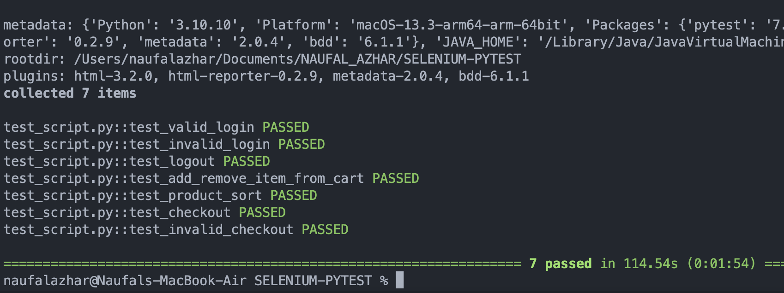

# WEB TESTING
- The given code is a Python code that uses Pytest and Selenium framework to perform testing on the Saucedemo website. There are four testing functions defined in the code: test_valid_login, test_invalid_login, test_logout, and test_checkout. Each testing function performs a series of actions, such as opening the website page, filling in the login form, clicking the logout button, or processing the payment, and checking whether the obtained results match the expected ones. The testing functions are performed using a browser fixture that loads the Selenium driver to perform testing on the Google Chrome browser.

# MOBILE APP TESTING
- This is a Python code that uses Pytest, Appium, and Selenium to automate testing for a mobile application. The code first defines a fixture called teardown_method() that quits the driver after each test. The platform to test is then selected by setting the platform variable to either "ios" or "android".

- Based on the selected platform, the code sets the capabilities required to launch the application on the respective platform. If the platform is Android, the caps dictionary is set with specific values such as the device name, platform version, app package, and app activity. Similarly, if the platform is iOS, the caps dictionary is set with specific values such as the device name, platform version, app path, and Universal Device Identifier (UDID).

- The test_main() function then performs the testing for each platform. If the platform is Android, the code executes two test cases called test_Add_to_cart() and test_checkout() defined in the android_test.py file. Similarly, if the platform is iOS, the code executes four test cases called test_login(), test_sort_button(), test_Add_to_cart(), and test_checkout() defined in the ios_test.py file.

- Overall, this code sets up the necessary configurations to test a mobile application on either Android or iOS platform and performs automated testing using Pytest.

## RUN
```
pytest -s     = run with debug
pytest -v     = run all test with desc
pytest        = run all test
```

